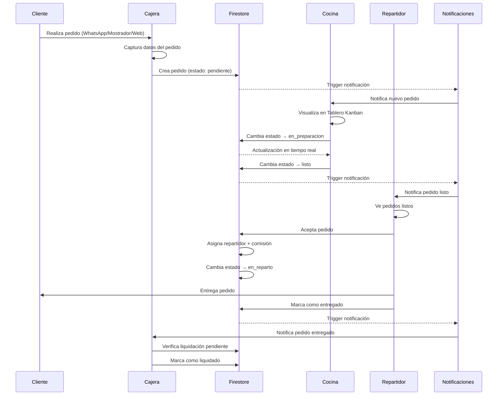
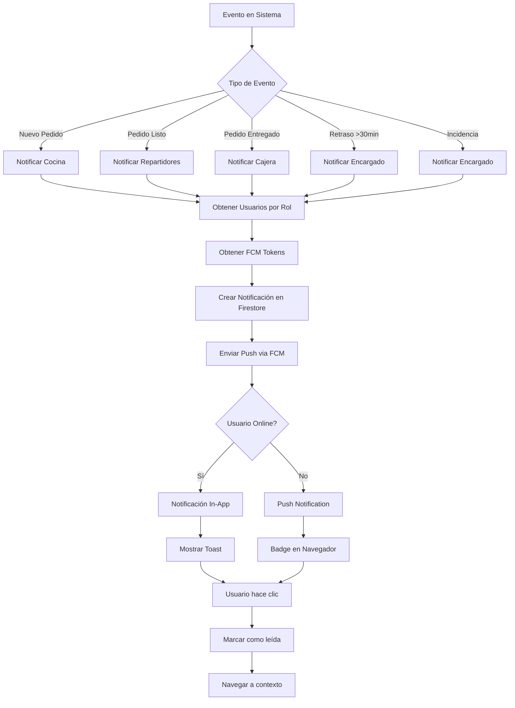
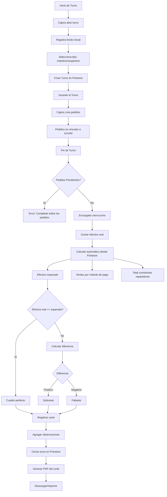
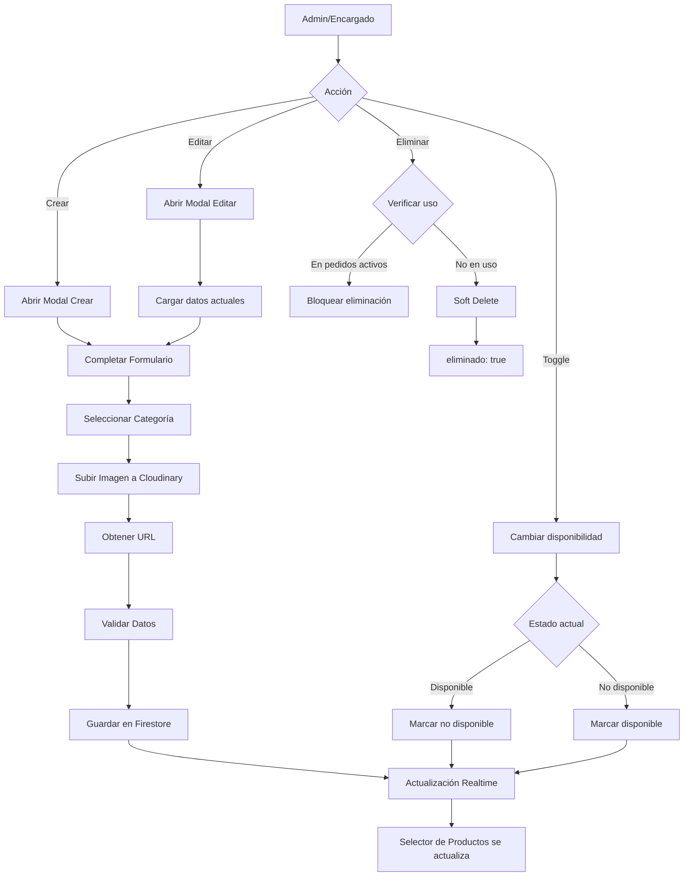
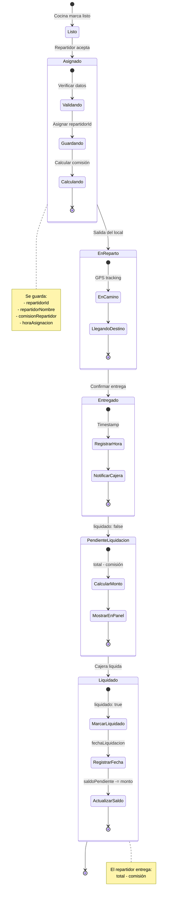
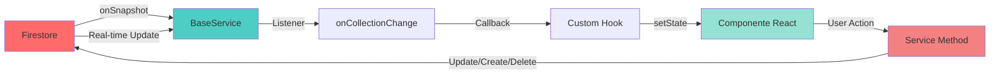
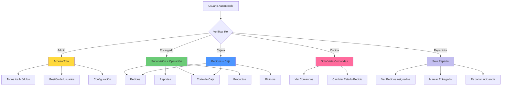
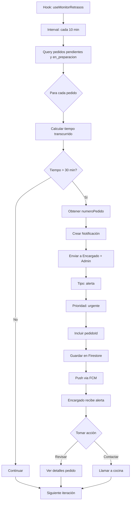

# 🔄 Diagramas de Flujo de Datos - Old Texas BBQ CRM

Este documento contiene los diagramas de flujo principales del sistema usando sintaxis Mermaid.

---

## 📦 1. Flujo Completo de Pedido



---

## 🔐 2. Flujo de Autenticación

```mermaid
graph TD
    A[Usuario Ingresa Credenciales] --> B{Validar Email/Password}
    B -->|Válido| C[Firebase Auth]
    B -->|Inválido| A

    C --> D[Obtener UID]
    D --> E[Buscar Usuario en Firestore]

    E --> F{Usuario Existe?}
    F -->|No| G[Error: Usuario no encontrado]
    F -->|Sí| H{Usuario Activo?}

    H -->|No| I[Error: Usuario desactivado]
    H -->|Sí| J[Obtener Rol]

    J --> K[Crear Sesión JWT]
    K --> L[Guardar en Cookie httpOnly]
    L --> M[Actualizar ultimaConexion]
    M --> N[Guardar FCM Token]
    N --> O[Redirigir a Dashboard]

    O --> P{Rol?}
    P -->|Cajera| Q[/pedidos]
    P -->|Cocina| R[/cocina]
    P -->|Repartidor| S[/reparto]
    P -->|Encargado/Admin| T[/dashboard]
```

---

## 🔔 3. Flujo de Notificaciones



---

## 💰 4. Flujo de Corte de Caja



---

## 🍔 5. Flujo de Gestión de Productos



---

## 🚚 6. Flujo de Reparto y Liquidación



---

## 🔄 7. Flujo de Sincronización en Tiempo Real



---

## 🎯 8. Flujo de Permisos por Rol



---

## ⏱️ 9. Flujo de Monitoreo de Retrasos



---

**Nota**: Estos diagramas son visualizables en GitHub, VS Code con extensión Mermaid, y muchas herramientas markdown modernas.

**Última actualización**: Enero 2026
**Versión**: 1.0
